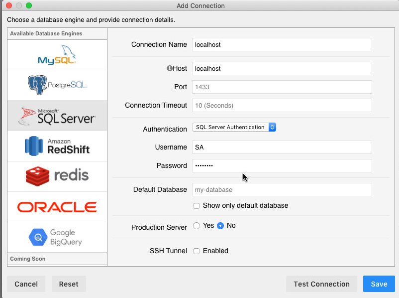
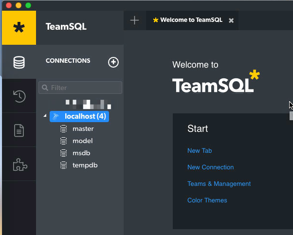

Database Sql Server Docker on Mac Demo
======================================

Install docker for mac first.

Pull image:

```
docker pull mcr.microsoft.com/mssql/server:2017-latest
```

Run:

```
docker run \
    --name sarbis-mac-sql \
    --env 'ACCEPT_EULA=Y' \
    --env 'MSSQL_SA_PASSWORD=abcd1234' \
    --publish 1433:1433 \
    --detach mcr.microsoft.com/mssql/server:2017-latest
```

Test:

```
$
docker ps
CONTAINER ID        IMAGE                                        COMMAND                  CREATED             STATUS              PORTS                    NAMES
0c0e1c3c2918        mcr.microsoft.com/mssql/server:2017-latest   "/opt/mssql/bin/sqls…"   20 minutes ago      Up 20 minutes       0.0.0.0:1433->1433/tcp   sarbis-mac-sql
```

Use telnet to test the port:

```
telnet localhost 1433
```

And use some sql server client like [teamsql](https://teamsql.io/download?os=osx), to connect:

- user: `SA`
- password: `abcd1234`




